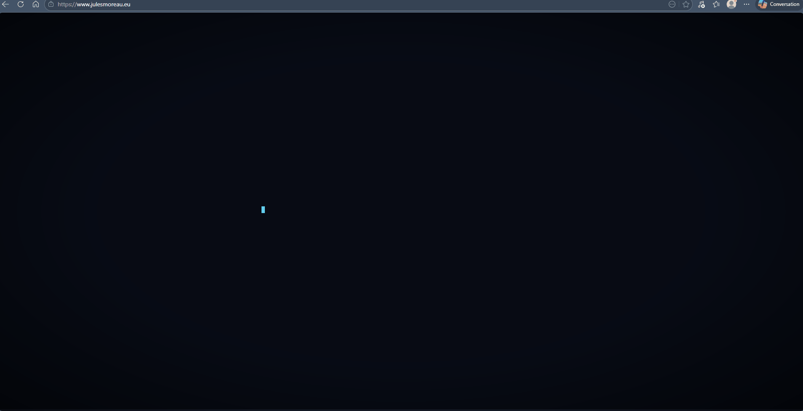

<!-- Header -->
<div align="center">


**Sport Management · Esports · AI-Augmented Development**

[](https://www.julesmoreau.eu)
[](https://www.linkedin.com/in/jules-moreau-25405b363)
[](https://maps.google.com/?q=Lille,France)

</div>

---

## 👾 About me

I'm a **M1 Sport Administration student** at Université de Lille (UFR STAPS), specializing in **sport management**. My profile sits at the crossroads of sport business strategy, digital communication, and self-taught AI-augmented development.

> *I don't write code from scratch — I build things that work, using AI as an execution layer.*

---

## 🛠️ What I build

### 🔭 [Sport Business Watch](https://github.com/julesmoreau62/veille-sport-biz)
Automated competitive intelligence pipeline scraping **35+ international sources**, Gemini AI filtering, deployed on a Next.js / Netlify dashboard — running at ~$1.17/month.

### 🌐 [GOTHAM Portfolio](https://github.com/julesmoreau62/gotham-portfolio)
Personal portfolio with a dark tactical aesthetic — IBM Plex Mono, navy/orange palette, AI crawler accessibility (llms.txt, JSON-LD), and a "How Was It Done?" build process page.



### 🤖 Sport Management LLM Fine-tuning
MLX pipeline on Apple Silicon (M4) to fine-tune **Qwen2.5-8B** on a custom sport management JSONL dataset, augmented with **RAG** over an extensive corpus of sport management literature and resources. Served locally via Open WebUI.

---

## 🧰 Stack & Tools


---

## 📡 Domain expertise

```
Sport Business       ████████████████████  Esports governance, rights, B2B models
Digital Communication ███████████████████  Social media, sponsor activation (+467% CTR)
AI & Automation      ████████████████░░░░  LLM fine-tuning, pipelines, prompt engineering
Web Development      █████████████░░░░░░░  JAMstack, APIs, serverless — no CS background
```

---

## 🎮 Side quests

- ⚔️ **Overwatch** — Former Top 500 · Currently Grandmaster · grinding back
- ⛳ **Golf** · 🏐 **Volleyball** · 📷 Amateur photographer (Sony α6400)
- 📚 Gibson · Watts · Herbert · Asimov

---


<div align="center">

*Open to opportunities in esports, sport business & AI — internship from April 2026.*

</div>
